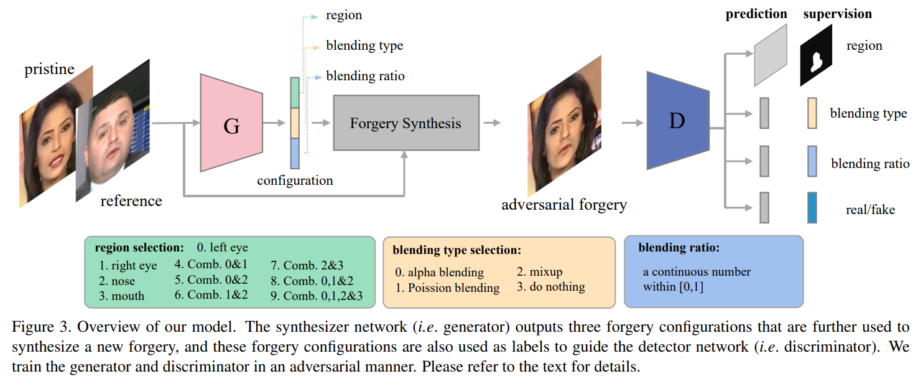

# Self-supervised Learning of Adversarial Example: Towards Good Generalizations for Deepfake Detection


This repository contains PyTorch implementation of the CVPR oral presentation paper:
> [Self-supervised Learning of Adversarial Example: Towards Good Generalizations for Deepfake Detection](https://arxiv.org/pdf/2203.12208.pdf). 
> 
> _Liang Chen, Yong Zhang, Yibing Song, Lingqiao Liu, Jue Wang_

The proposed method uses adversarial self-supervised training to improve the generability of current deepfake detectors. The pipeline is illustrated in the following figure:




Preparation
-
#### pacakges
Please refer to the requirements.txt for details.

#### pretrained weights
Download [Xception](https://drive.google.com/file/d/1LZZeelRkG12de-YCz9_3Z22SofVJmyyS/view?usp=sharing) pretrained weights and [dlib](https://drive.google.com/file/d/1DB5-AsWHBpfprMccNt_6U0S1gl2L-5Zk/view?usp=sharing) landmark predictor and put them in the weights folder.

Datasets
-
#### training datasets
We use the FaceForensicsDataset ([FF++](https://github.com/ondyari/FaceForensics)) for training. Please go to their project page for downloading. For every video in FF++ dataset, we extract 270 frames for training, and 100 each for evaluation and testing rigously following their data splitting strategy. The data structure is like:
```
    SLADD project
    |---README.md
    |---...
    |---data
        |---FF
            |---image
                |---FF-DF
                    |---071_054 
                        |---0001.png  
                        |---...
                    |---...
                |---FF-F2F
                |---FF-FS
                |---FF-NT
                |---real
            |---mask
                |---FF-DF
                    |---071_054 
                        |---0001_mask.png  
                        |---...
                    |---...
                |---FF-F2F
                |---FF-FS
                |---FF-NT
            |---config
                |---train.json
                |---test.json
                |---eval.json

```

#### test datasets
We use the [DFDC](https://ai.facebook.com/datasets/dfdc/), [CelebDF](https://github.com/yuezunli/celeb-deepfakeforensics), and [DF1.0](https://github.com/EndlessSora/DeeperForensics-1.0) for testing. These datasets are organized similar to FF++. Please go to their sites for downloading.


Running
- 
 ```
	python train.py  --resolution 256 --dataname none --dset FF-DF --meta FF-DF -n 1 -g 8 -nr 0  -mp 5555
```
    

Citation
-
If you find this code useful for your research, please cite:
  ```
  @inproceedings{chen2022self,
      author = {Liang Chen and Yong Zhang and Yibing Song and Lingqiao Liu and Jue Wang},
      title = {Self-supervised Learning of Adversarial Examples: Towards Good Generalizations for DeepFake Detections}, 
      booktitle = {CVPR},  
      year = {2022}
  }
  ```


Contact
-
Please open an issue or contact Liang Chen (<liangchen527@gmail.com>) if you have any questions or any feedback.